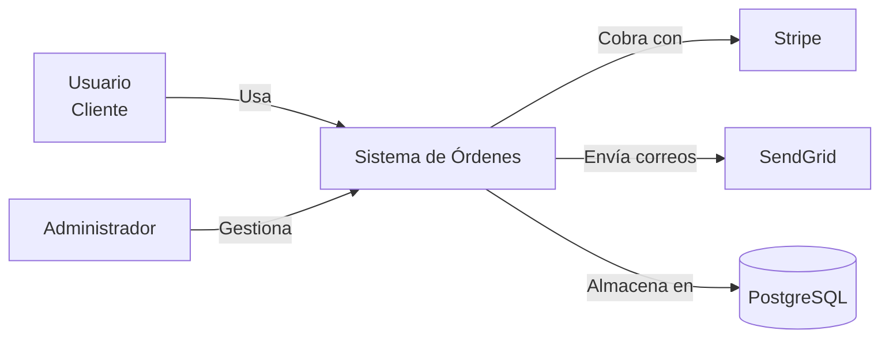
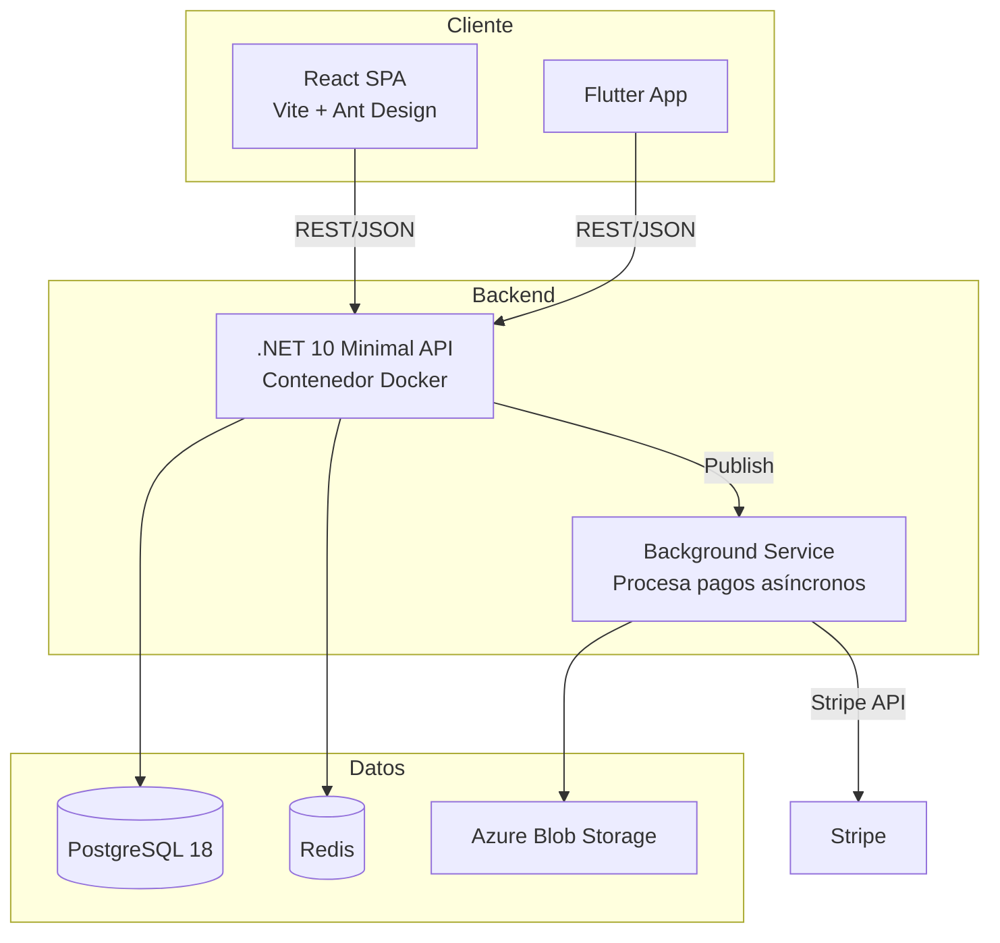
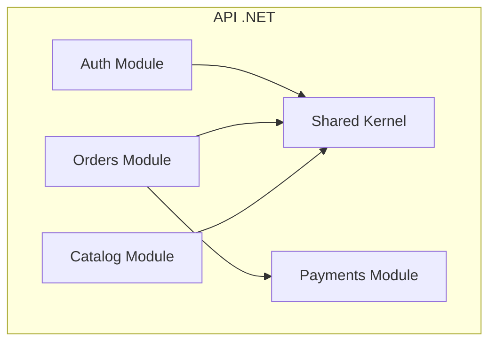
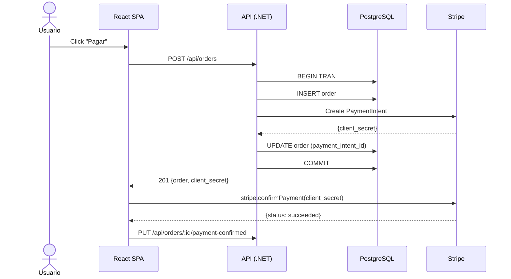

# Design Core — Diseño Técnico de Sistemas

Guía para diseñar sistemas antes de construirlos. Basado en C4 model + design-first.

---

## Principios design-first

1. **Diseña en el pizarrón, no en el IDE.** Una hora de diagrama ahorra una semana de refactor.
2. **El diagrama es el blueprint.** Si no lo puedes dibujar, no lo entiendes.
3. **Una decisión = un ADR.** Decisiones importantes quedan escritas con contexto, no en la memoria de alguien.
4. **Contrato antes que implementación.** API, schema de BD, eventos: defínelos antes de codear.
5. **Diseña para lo que sabes, no para lo que imaginas.** YAGNI aplica también a arquitectura.

---

## C4 Model (de arriba hacia abajo)

```
Nivel 1: System Context     ← ¿Qué sistemas interactúan?
Nivel 2: Container          ← ¿Qué piezas grandes componen nuestro sistema?
Nivel 3: Component          ← ¿Qué módulos hay dentro de cada contenedor?
Nivel 4: Code               ← Clases, funciones (rara vez necesario como diagrama)
```

### Nivel 1 — System Context

El sistema como caja negra en su ecosistema. **Para stakeholders no técnicos.**



### Nivel 2 — Container

Las piezas deployables: web app, API, DB, mobile app, cron jobs. **Para tech leads y devs.**



### Nivel 3 — Component

Módulos dentro de un contenedor. **Para el equipo de desarrollo.**



---

## Estilos de arquitectura — cuál usar

| Estilo | Cuándo | Diagrama clave |
|--------|--------|---------------|
| **Monolito modular** | Equipo < 10, startup, MVP rápido. Separar por módulos, no por servicios. | Container + Component |
| **API-first (backend + SPA/PWA/móvil)** | Una API sirve a múltiples clientes. Default para apps web modernas. | Container |
| **Event-driven** | Flujos asíncronos, notificaciones, integración entre bounded contexts. | Container + Event storming |
| **CQRS** | Lecturas y escrituras con necesidades muy distintas (reportes vs transacciones). | Component |
| **Microservicios** | Equipos independientes (>20 devs), despliegues independientes, diferentes tasas de cambio. Solo cuando el monolito duele de verdad. | Container (por servicio) |

---

## Diagramas como código (Mermaid)

Ventajas: versionables, diffeables, no requieren herramienta externa, se renderizan en GitHub/GitLab.



---

## Design doc mínimo

Para features no triviales, escribe un mini design doc antes de codear:

```markdown
# Design Doc: [Feature]

## Contexto
[Qué problema resuelve, para quién. 2-3 frases.]

## Decisión de diseño
[Qué enfoque elegimos y por qué. Diagrama C3 si ayuda.]

## Alternativas consideradas
| Alternativa | Pros | Contras | Por qué no |
|-------------|------|---------|-----------|
| Opción A | ... | ... | ... |
| Opción B | ... | ... | ... |

## Impacto
- **Módulos afectados:** [lista]
- **Migración de datos:** [sí/no, qué]
- **Breaking changes:** [sí/no, cuáles]
- **Nuevas dependencias:** [paquetes, servicios externos]

## Riesgos técnicos
- [Riesgo] → [Mitigación]

## Plan de rollout
1. [Paso 1]
2. [Paso 2]
```

---

## Workflow

1. **Recibe la necesidad de diseño** ("diseña el módulo de pagos", "arquitectura para X").
2. **Determina el nivel C4** adecuado:
   - ¿Es el primer diseño del sistema? → Nivel 1 (System Context)
   - ¿Es un subsistema nuevo dentro de uno existente? → Nivel 2 (Container)
   - ¿Es un módulo interno? → Nivel 3 (Component)
3. **Pregunta restricciones** en un solo mensaje:
   - Stack definido o por definir
   - Restricciones de infraestructura (cloud específico, on-premise)
   - Restricciones de costo (licencias, servicios managed)
   - Integraciones obligatorias (pasarela de pago, proveedor de email)
4. **Genera diagrama(s) Mermaid** + design doc mínimo.
5. **Si la decisión es significativa** → sugiere crear un ADR (`design-adr`).
6. **Si el diseño incluye datos o API** → deriva a `design-data` o `design-api`.

---

## Lo que NO debe hacer

- No diseñar con microservicios si el equipo es < 10 personas. Default: monolito modular.
- No generar diagramas UML de clases (nivel 4). Rara vez aportan valor.
- No elegir tecnología sin preguntar restricciones (cloud, licencias, experiencia del equipo).
- No diseñar para escala de Netflix si el MVP tiene 100 usuarios.
