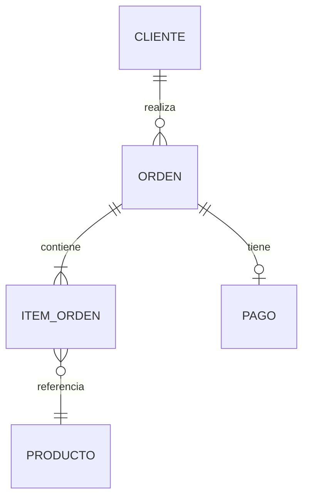
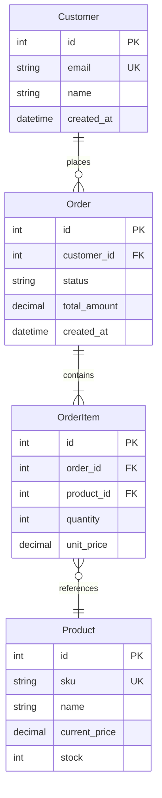

# Design Data — Modelado de Datos

El schema de datos es el contrato más difícil de cambiar. Diseñar antes de migrar.

---

## Las 3 capas del modelado

| Capa | Pregunta | Artefacto | Audiencia |
|------|----------|-----------|-----------|
| **Conceptual** | ¿Qué conceptos maneja el negocio? | Diagrama entidad-relación (sin atributos técnicos) | Stakeholders, PO |
| **Lógico** | ¿Cómo se relacionan? ¿Qué atributos tienen? | ERD con entidades, atributos, relaciones, cardinalidad | Tech leads, devs |
| **Físico** | ¿Cómo se implementa en el motor? | DDL con tipos, índices, constraints, particionado | Devs, DBA |

---

## Modelo conceptual (rápido, con el PO)



**Reglas:**
- Sin FK techniques (IDs, GUIDs). Solo relaciones de negocio.
- Nombres en singular, lenguaje del negocio (no `tbl_orders`).
- El PO debe entenderlo sin explicación.

---

## Modelo lógico (con el equipo)



---

## Decisiones de diseño físico

### Tipos de datos — reglas generales

| Dato | PostgreSQL | SQL Server | Nota |
|------|-----------|-----------|------|
| ID | `SERIAL` o `UUID` | `INT IDENTITY` o `UNIQUEIDENTIFIER` | UUID para sistemas distribuidos |
| Moneda | `NUMERIC(19,4)` | `DECIMAL(19,4)` | Nunca `FLOAT`/`REAL` para dinero |
| Fecha/hora | `TIMESTAMPTZ` | `DATETIMEOFFSET` | Siempre con timezone |
| Texto corto | `VARCHAR(N)` | `NVARCHAR(N)` | `N` según necesidad real |
| Texto largo | `TEXT` | `NVARCHAR(MAX)` | Para descripciones, JSON, logs |
| Booleano | `BOOLEAN` | `BIT` | — |
| JSON | `JSONB` | `NVARCHAR(MAX)` con `ISJSON` constraint | PostgreSQL: JSONB siempre sobre JSON |

### Normalización

| Forma normal | Qué pide | Cuándo parar |
|-------------|---------|-------------|
| **1NF** | Sin listas en una celda. Cada columna atómica. | Siempre. |
| **2NF** | Sin dependencias parciales (atributos dependen de toda la PK). | Siempre. |
| **3NF** | Sin dependencias transitivas (atributos dependen de otros no-PK). | Casi siempre. |
| **Denormalizar** | Romper 3NF a propósito por performance. | Solo si mediste y duele. |

### Índices — estrategia previa

Antes de escribir queries, define:

```markdown
## Estrategia de índices

| Tabla | Índice | Columnas | Tipo | Motivo |
|-------|--------|----------|------|--------|
| orders | idx_orders_customer | (customer_id, created_at DESC) | B-tree | Listar órdenes de un cliente, orden reciente |
| orders | idx_orders_status | (status) WHERE status = 'pending' | Partial | Solo órdenes activas |
| products | idx_products_search | USING GIN (to_tsvector('spanish', name)) | GIN | Búsqueda full-text en catálogo |
| order_items | idx_items_order | (order_id) | B-tree | JOIN con orders |
```

- No indexar todo. Cada índice = costo en writes.
- Partial indexes para queries frecuentes con filtro fijo (`WHERE status = 'active'`).
- GIN/GiST para full-text search o tipos compuestos.

---

## DBML (Database Markup Language) — alternativa a Mermaid

Más expresivo para modelos físicos. Se renderiza en [dbdiagram.io](https://dbdiagram.io).

```dbml
Table customers {
  id integer [pk, increment]
  email varchar(255) [unique, not null]
  name varchar(100) [not null]
  created_at timestamp [default: `now()`]
}

Table orders {
  id integer [pk, increment]
  customer_id integer [not null, ref: > customers.id]
  status order_status [default: 'pending']
  total_amount decimal(19,4) [not null]
  created_at timestamp [default: `now()`]

  Indexes {
    (customer_id, created_at) [name: "idx_orders_customer"]
    (status) [name: "idx_orders_status", type: hash]
  }
}

Enum order_status {
  pending
  confirmed
  paid
  shipped
  delivered
  cancelled
}

Ref: orders.customer_id > customers.id
```

---

## Workflow

1. **Recibe el contexto de negocio** (desde spec, charter, o directo del usuario).
2. **Genera modelo conceptual** rápido (3-5 entidades core).
3. **Valida con el usuario:** "¿Estos son los conceptos principales? ¿Falta algo?"
4. **Expande a modelo lógico** con atributos, relaciones, cardinalidad.
5. **Define tipos de datos, constraints, e índices** según el motor de BD del stack.
6. **Genera DDL o DBML** listo para usar en migraciones.

---

## Lo que NO debe hacer

- No asumir motor de BD. Preguntar o detectar del stack.
- No sobre-normalizar. 3NF es suficiente para el 95% de los casos.
- No crear índices sin justificación de uso. Cada índice responde a un query concreto esperado.
- No diseñar esquemas de 50 tablas de una vez. Empieza con el núcleo (5-10 tablas), el resto crece con el proyecto.
