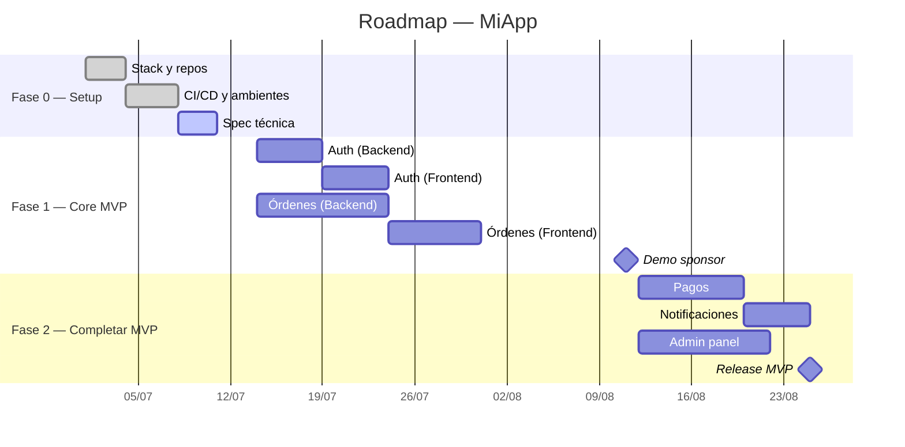

# Planning Roadmap — Timeline y Entregables

De charter a fechas. Sin MS Project, sin Gantt de 200 líneas.

---

## Estructura del roadmap

```markdown
# Roadmap — [Proyecto]

## 🎯 Visión general
[1 frase. A dónde vamos.]

---

## Fase 0 — Setup (Semanas 1-2)
**Objetivo:** Todo listo para empezar a construir.
- [ ] Stack definido y aprobado
- [ ] Repositorios creados, CI/CD corriendo
- [ ] Ambientes: dev, staging
- [ ] Accesos: DB, cloud, APIs externas
- [ ] Spec técnica del MVP (`productivity-spec`)

## Fase 1 — Core MVP (Semanas 3-6)
**Objetivo:** El flujo principal funciona de punta a punta.
- [ ] Registro/login de usuarios
- [ ] Creación de orden (flujo feliz)
- [ ] Visualización de estado de orden
- [ ] **Demo al sponsor:** Semana 6

## Fase 2 — Completar MVP (Semanas 7-10)
**Objetivo:** Funcionalidad completa del MVP.
- [ ] Pagos integrados (Stripe/MercadoPago)
- [ ] Notificaciones por email
- [ ] Panel de administración básico
- [ ] **Release MVP:** Semana 10

## Fase 3 — Post-MVP (Semanas 11+)
**Objetivo:** Features Should/Could have.
- [ ] Dashboard de analytics
- [ ] Exportación a Excel/PDF
- [ ] App móvil (PWA o nativa)
- [ ] **Release v1.1:** Semana 14
```

---

## Dependencias entre equipos/sistemas

Para proyectos con múltiples equipos o integraciones:

```markdown
## Dependencias

| Entrega | Equipo responsable | Equipo dependiente | Fecha necesaria | Estado |
|---------|-------------------|-------------------|-----------------|--------|
| API de autenticación v1 | Backend | Frontend, Móvil | Semana 2 | ✅ Listo |
| Sandbox de pagos | Stripe (externo) | Backend | Semana 3 | ⬜ Pendiente |
| Diseño final de UI | Diseño | Frontend | Semana 4 | 🔄 En progreso |
| Endpoint de reportes | Backend | Frontend | Semana 8 | ⬜ Pendiente |
```

---

## Timeline visual (Mermaid Gantt)



---

## Indicadores de salud del cronograma

Revisa cada semana:

| Indicador | Verde | Amarillo | Rojo |
|-----------|-------|----------|------|
| **Completado vs planeado** | ≥90% | 70-89% | <70% |
| **Bloqueantes abiertos** | 0 | 1-2 | ≥3 |
| **Dependencias externas en riesgo** | 0 | 1 | ≥2 |
| **Horas extra del equipo** | 0 | <10% | ≥10% |

Regla: si 2+ indicadores están en rojo, escala al sponsor.

---

## Estrategia de entregas progresivas

En lugar de un gran release al final:

| Entrega | Qué incluye | A quién | Cuándo |
|---------|------------|---------|--------|
| **Alpha** (interno) | Flujo core, con bugs conocidos | Equipo + sponsor | Semana 4 |
| **Beta** (testers) | MVP completo, pulido | Grupo de usuarios piloto | Semana 8 |
| **GA** (general) | MVP + fixes del beta | Todos los usuarios | Semana 10 |

---

## Workflow

1. **Recibe el charter** (`planning-core`) o el scope definido.
2. **Pregunta fecha objetivo** (si hay deadline dura) y tamaño del equipo.
3. **Divide en fases de 2-4 semanas** (no más largas, pierden significado).
4. **Genera Gantt en Mermaid** — lo suficiente para visualizar paralelismos.
5. **Identifica dependencias externas** con otros equipos/sistemas.
6. **Marca milestones de demo/release** para mantener ritmo.

---

## Lo que NO debe hacer

- No planear con precisión de días para fases > 1 mes. A más lejos, menos detalle.
- No asumir velocidad del equipo. Usar rangos: "Semanas 3-6" no "5/jul — 18/jul".
- No generar 50 tareas. El roadmap es hitos y fases, no tareas. Las tareas van en `sputnik-core` o en el board del sprint.
