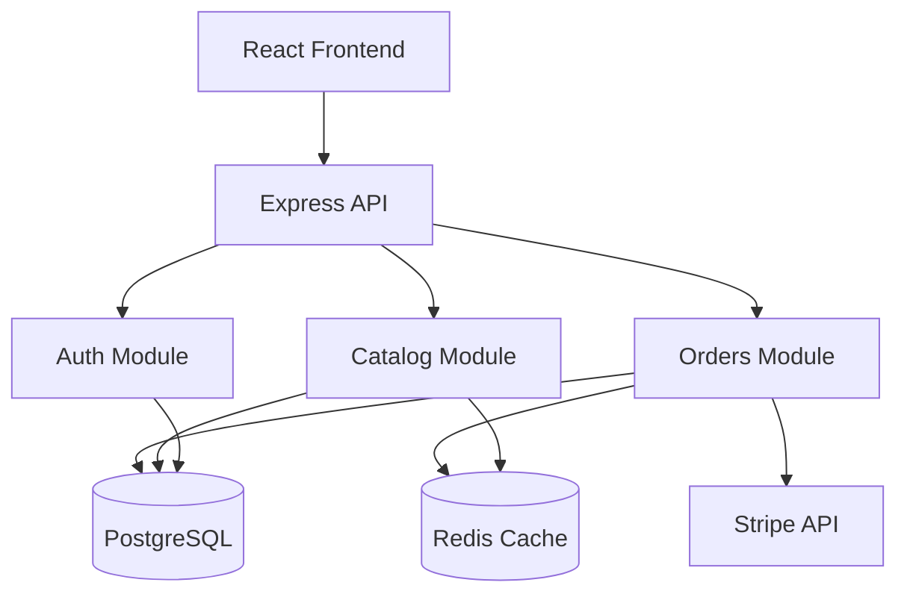

# Productivity Docs — Código a Documentación

Genera documentación desde el código fuente. Lee routers, módulos y estructura de proyecto para producir docs actualizadas.

---

## Workflow

### Paso 1: Detectar el stack y estructura

Carga los dev-kits relevantes para saber qué convenciones de proyecto esperar:

| Stack | Rutas/Endpoints | Módulos | Entry point |
|-------|----------------|---------|-------------|
| **Express** | `router.get('/api/orders', ...)` | `src/modules/{nombre}/` | `src/index.ts` |
| **FastAPI** | `@router.get("/api/orders")` | `src/miapp/modules/{nombre}/` | `src/miapp/main.py` |
| **.NET** | `app.MapGet("/api/orders", ...)` | `MiApp.Application/{Modulo}/` | `Program.cs` |
| **Next.js** | `src/app/{ruta}/page.tsx` | `src/app/{grupo}/` | `src/app/layout.tsx` |
| **React SPA** | React Router `<Route path="/orders">` | `src/pages/{nombre}/` o `src/features/{nombre}/` | `src/main.tsx` |

### Paso 2: Generar README.md

Si no existe o está incompleto (menos de 10 líneas), generar:

```markdown
# [Nombre del Proyecto]

[Descripción de 1 línea extraída del package.json/pyproject.toml o del entry point]

## 🚀 Quick Start

```bash
git clone [url]
cd [proyecto]
cp .env.example .env
docker compose up
```
Abrir http://localhost:[puerto]

## 🧱 Stack

| Capa | Tecnología |
|------|-----------|
| Backend | [stack] |
| Frontend | [stack] |
| Database | [stack] |

## 📚 Documentación

- [Arquitectura](docs/ARCHITECTURE.md)
- [API Reference](docs/API.md)
- [Onboarding](ONBOARDING.md) (si existe)

## 🧪 Testing

```bash
[comando de test]
```

## 🚀 Deploy

[1-2 líneas de cómo se deploya, extraído de CI/CD o Dockerfile]

## 📄 Licencia

[LICENSE file content or "Proprietary"]
```

Si ya existe README.md sustancial (>20 líneas), solo sugerir mejoras, no reemplazar.

### Paso 3: Generar ARCHITECTURE.md

#### Diagrama Mermaid

Analizar imports entre módulos para detectar dependencias:

```python
# Pseudocódigo de análisis
for module in src/modules/*:
    imports = grep "from.*{module}" or "import.*{module}"
    if imports:
        add_edge(module_a, module_b)
```

Generar diagrama:



#### Descripción de módulos

Para cada módulo, extraer:
- **Propósito**: 1 frase de la documentación o del nombre del módulo
- **Endpoints** (si aplica): lista de rutas detectadas
- **Dependencias**: qué otros módulos/servicios usa
- **Archivos clave**: controller, service, repository, schema

```markdown
### Orders Module (`src/modules/orders/`)

**Propósito**: Gestiona el ciclo de vida completo de órdenes de compra.

**Endpoints:**
| Método | Ruta | Descripción |
|--------|------|-------------|
| GET | `/api/orders` | Listar órdenes con filtros y paginación |
| POST | `/api/orders` | Crear nueva orden |
| GET | `/api/orders/:id` | Obtener detalle de orden |
| DELETE | `/api/orders/:id` | Cancelar orden |

**Dependencias:** Stripe (pagos), Redis (caché de estado), Catalog (validar stock)

**Archivos clave:**
- `orders.controller.ts` — HTTP handlers
- `orders.service.ts` — Lógica de negocio
- `orders.repository.ts` — Acceso a datos (Drizzle)
```

### Paso 4: Generar API.md

Escanea el código fuente para detectar todos los endpoints/rutas:

#### Express

```typescript
// Detecta patrones: router.get('/path', handler), router.post('/path', handler)
// Extrae: método, ruta, parámetros de ruta (:id), middleware aplicado (auth, validate)
```

#### FastAPI

```python
# Detecta patrones: @router.get("/path"), @router.post("/path")
# Extrae: método, ruta, response_model, status_code, dependencies
```

#### .NET Minimal API

```csharp
// Detecta patrones: app.MapGet("/path", handler), app.MapPost("/path", handler)
// Extrae: método, ruta, parámetros, .RequireAuthorization(), .AddValidation()
```

#### React Router

```tsx
// Detecta patrones: <Route path="/path" element={...} />, createFileRoute('/path')
// Extrae: ruta, loader, si requiere auth
```

Generar tabla:

```markdown
# API Reference

## Orders

| Método | Ruta | Auth | Descripción | Request Body | Response |
|--------|------|------|-------------|-------------|----------|
| GET | `/api/orders` | JWT | List orders | Query: `?page=1&status=pending` | `PaginatedResponse<Order>` |
| POST | `/api/orders` | JWT | Create order | `CreateOrderInput` | `Order` (201) |
| GET | `/api/orders/:id` | JWT | Get order by ID | — | `Order` |
| DELETE | `/api/orders/:id` | JWT | Cancel order | — | `{ success: true }` |

## Catalog

| Método | Ruta | Auth | Descripción |
|--------|------|------|-------------|
| GET | `/api/catalog` | — | List products with search |
| GET | `/api/catalog/:sku` | — | Get product by SKU |
```

### Paso 5: Guardar y reportar

```
✅ Documentación generada:
📄 README.md — actualizado
📄 docs/ARCHITECTURE.md — creado (diagrama Mermaid + 3 módulos)
📄 docs/API.md — creado (12 endpoints detectados)

Endpoints sin documentar (sin comentarios/JSDoc): 3
Módulos sin descripción: 1
```

Ofrecer completar los gaps si el usuario quiere.

---

## Lo que NO debe hacer

- No inventar descripciones de módulos si no hay información suficiente. Usar `[Describir]` como placeholder.
- No reemplazar README.md si ya tiene contenido sustancial (>20 líneas propias).
- No incluir rutas de archivos internos en API.md (solo rutas HTTP).
- No generar docs para `node_modules`, `dist`, `build`, `.venv`, `bin/obj`.
- No asumir parámetros de query que no están en el código. Si usas Zod/Pydantic, leer el schema; si no, inferir del uso de `req.query`.
